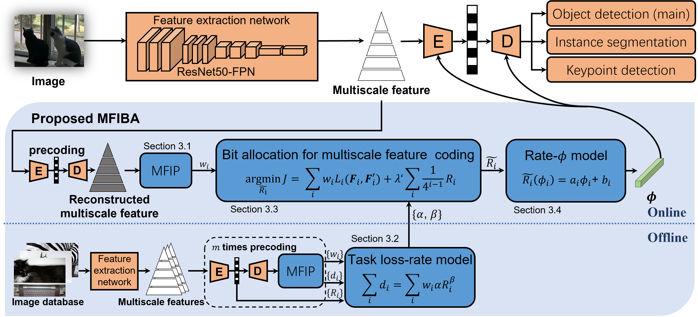

# MFIBA
# Multiscale Feature Importance-based Bit Allocation for End-to-End Feature Coding for Machines


Multiscale Feature Importance-based Bit Allocation for End-to-End Feature Coding for Machines \
[[paper]](https://dl.acm.org/doi/10.1145/3748654) [[code]](https://github.com/SYSU-Video/MFIBA) \ [Junle Liu](https://github.com/liujle), \ [Yun Zhang](https://codec.siat.ac.cn/yunzhang/), \
*ACM TOMM, 2025*

## Abstract
Feature Coding for Machines (FCM) aims to compress intermediate features effectively for remote intelligent analytics, which is crucial for future intelligent visual applications. In this paper, we propose a Multiscale Feature Importance-based Bit Allocation (MFIBA) for end-to-end FCM. First, we find that the importance of features for machine vision tasks varies with the scales, object size, and image instances. Based on this finding, we propose a Multiscale Feature Importance Prediction (MFIP) module to predict the importance weight for each scale of features. Secondly, we propose a task loss-rate model to establish the relationship between the task accuracy losses of using compressed features and the bitrate of encoding these features. Finally, we develop a MFIBA for end-to-end FCM, which is able to assign coding bits of  multiscale features more reasonably based on their importance. Experimental results demonstrate that when combined with a retained Efficient Learned Image Compression (ELIC), the proposed MFIBA achieves an average of 38.202% bitrate savings in object detection compared to the anchor ELIC. Moreover, the proposed MFIBA achieves an average of 17.212% and 36.49% feature bitrate savings for instance segmentation and keypoint detection, respectively. When the proposed MFIBA is applied to the LIC-TCM, it achieves an average of 18.103$\%$, 19.866% and 19.597% bit rate savings on three machine vision tasks, respectively, which validates the proposed MFIBA has good generalizability and adaptability to different machine vision tasks and FCM base codecs.
<p align="center">
  
</p>

## Requirements

🧩 This project was trained and tested with:

- 🐍 **Python** 3.8

📦 To install required packages, simply run:

```bash
pip install -r fasterrcnn_getw/requirements.txt
```

## 📊 Dataset
In this work, we employed COCO2017 dataset. 
### COCO2017 Directory Structure
```
├── annotations
  ├── instances_train2017.json
  ├── instances_val2017.json
  ├── panoptic_train2017.json
  ├── panoptic_val2017.json
  ├── person_keypoints_train2017.json
  └── person_keypoints_val2017.json
├── train
└── val
```
For simplicity, we recommend precoding multiscale features through different codecs and storing the results in designated directories. Example path: /home/ta/liujunle/sda2/ELIC/features_for_elic/. 
### Coding Results Directory Structure
```
├── features_for_elic
  ├── feature_decode_1
  ├── feature_decode_2
  ├── feature_decode_3
  ...
├── kp_features_for_elic
└── mask_features_for_elic
```

## Test
### Object detection
<pre> python /home/ta/liujunle/sda2/fasterrcnn_getw/train.py --data-path path-to-coco --dataset coco --num-classes 90 --model resnet50 --batch-size 16 --pretrained --test-only --lmbda_for_update 1000 </pre>
### Instance segmentation
<pre> python /home/ta/liujunle/sda2/fasterrcnn_getw/train_maskrcnn.py --data-path path-to-coco --dataset coco --num-classes 90 --model mask_rcnn --batch-size 16 --pretrained --test-only --lmbda_for_update 1000 </pre>
### Keypoint detection
<pre> python /home/ta/liujunle/sda2/fasterrcnn_getw/train_keypoint.py --data-path path-to-coco --dataset coco_kp --num-classes 90 --model keypoint_rcnn --batch-size 16 --pretrained --test-only --lmbda_for_update 1000 </pre>

## 📖 Citation

If you find our work useful or relevant to your research, please kindly cite our paper:

```bibtex
@article{10.1145/3748654,
author = {Liu, Junle and Zhang, Yun and Guo, Zixi and Huang, Xiaoxia and Jiang, Gangyi},
title = {Multiscale Feature Importance-based Bit Allocation for End-to-End Feature Coding for Machines},
year = {2025},
publisher = {Association for Computing Machinery},
address = {New York, NY, USA},
issn = {1551-6857},
url = {https://doi.org/10.1145/3748654},
doi = {10.1145/3748654},
note = {Just Accepted},
journal = {ACM Trans. Multimedia Comput. Commun. Appl.},
month = aug,
keywords = {Feature coding for machines, deep learning, image coding, bit allocation, object detection}
}
